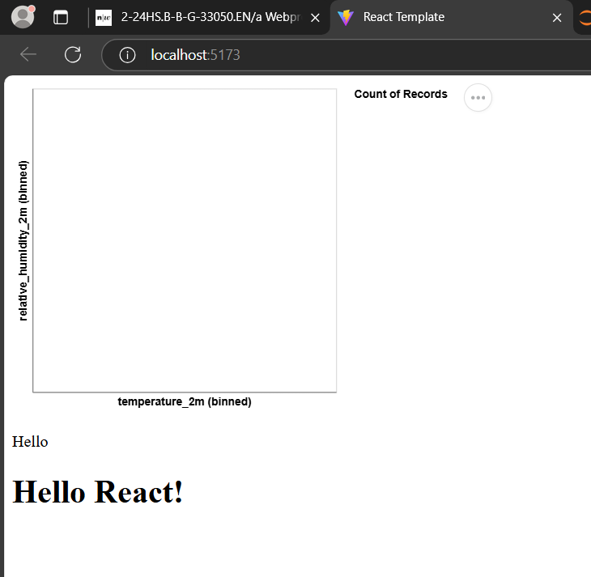

# React Template
First of all copy the ssh url to this github repository and execute the following commands in your working directory. 
1. ```git clone <ssh-url>```
2. ```cd app-template/```
3. ```npm i```
4. ```npm run dev```


